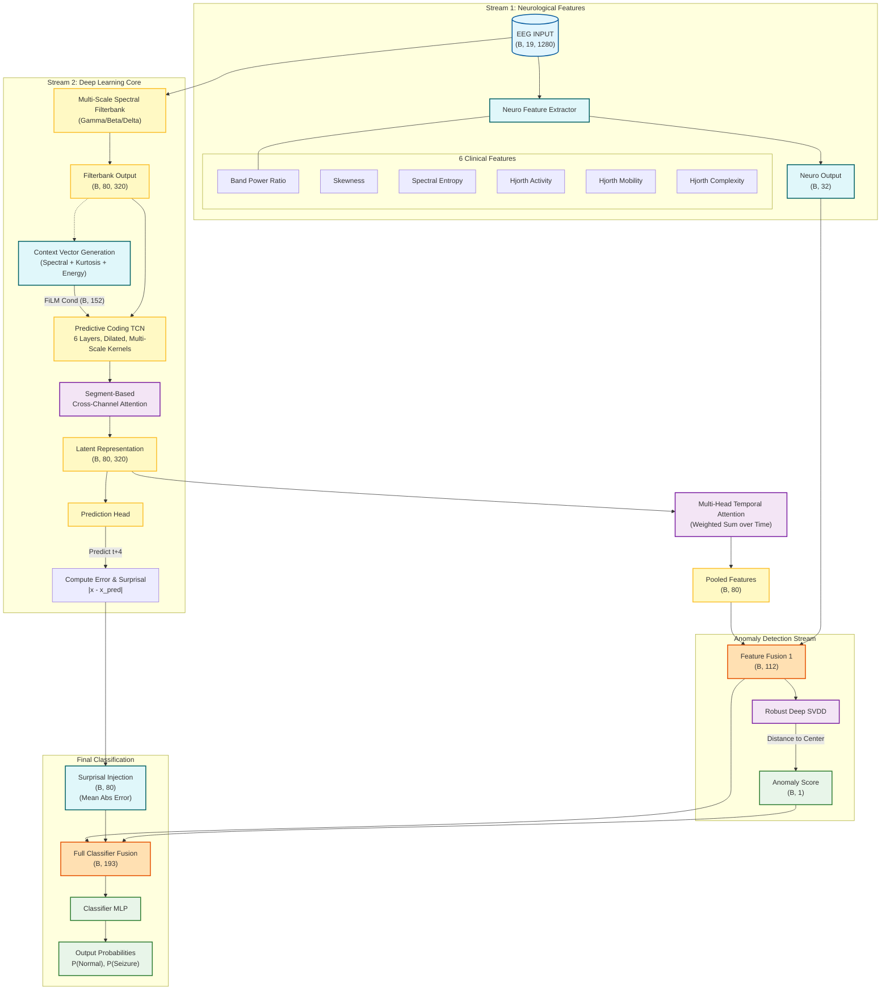
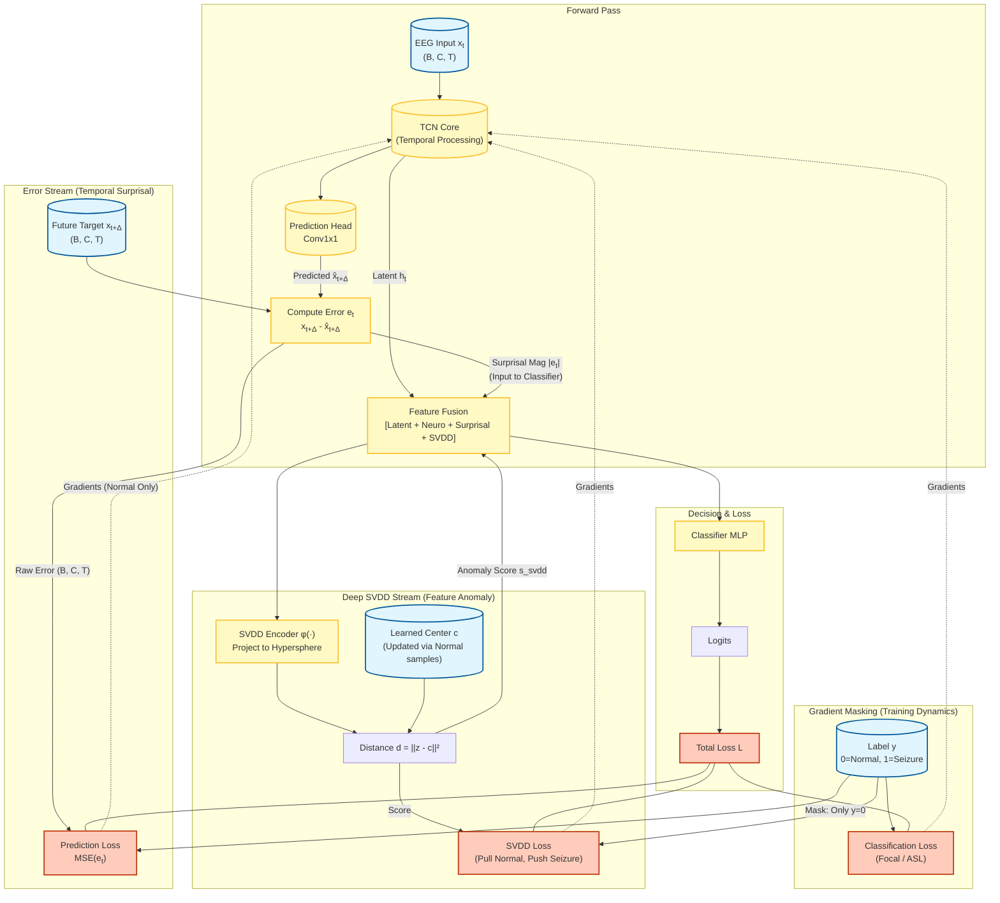

# Neuro-ADEPT v5.0 Architecture Guide

## Complete Model Architecture & Design Rationale

This document provides comprehensive technical specifications for **Neuro-ADEPT v4.5** (Anomaly Detection via Error-driven Predictive Temporal processing), with all layer shapes, attention mechanisms, and improvements.

---

## 1. High-Level Architecture Overview 

## 1. High-Level Architecture Overview



---

## 2. v4.5 Key Improvements Summary

| Component | v4.3 (Previous) | v4.5 (Current) | Why Changed |
|-----------|-----------------|----------------|-------------|
| **NeuroFeatures** | Line Length | **Skewness** | Seizures have asymmetric amplitude distributions |
| **Context Features** | Line Length | **Kurtosis** | Better spike detection via "tailedness" |
| **CrossChannelAttention** | Pool ALL time first | **Segment-based** (4 seg) | Preserves temporal dynamics |
| **SVDD Center** | Simple EMA | **Robust MAD + Adaptive** | Outlier rejection, NaN prevention |
| **Sampling** | WeightedRandomSampler | **BalancedBatchSampler** | Avoid double-penalty |
| **Loss Function** | Focal Loss | **Asymmetric Loss (ASL)** | Suppresses easy negatives to boost sensitivity |
| **Surprisal Injection** | Mean Abs Error | **Peak Surprisal (Mean+Max)** | Captures transient, high-amplitude anomalies |
| **Class Weights** | 5.0x boost | **2.0x boost** | Prevent over-optimization for specificity |

---

## 3. Detailed Layer Specifications

### 3.1 Neurological Feature Extractor (v4.5)

```
┌─────────────────────────────────────────────────────────────────────────────┐
│                    NEUROLOGICAL FEATURE EXTRACTOR v4.5                       │
├─────────────────────────────────────────────────────────────────────────────┤
│                                                                              │
│  Input: x (B, 19, 1280)                                                      │
│                                                                              │
│  Feature Computation (per channel, no learnable params):                     │
│  ┌─────────────────────────────────────────────────────────────────────────┐│
│  │                                                                          ││
│  │  1. Band Power Ratio:                                                    ││
│  │     dx = x[:,:,1:] - x[:,:,:-1]      # First derivative                 ││
│  │     d2x = dx[:,:,1:] - dx[:,:,:-1]   # Second derivative                ││
│  │     ratio = log(Var(d2x) / Var(x))   → (B, 19)                          ││
│  │                                                                          ││
│  │  2. SKEWNESS (v4.5 - replaces line_length):                             ││
│  │     μ = mean(x, dim=2)                                                   ││
│  │     σ = std(x, dim=2)                                                    ││
│  │     skew = mean(((x - μ) / σ)³)      → (B, 19)  [-10, 10] clamped       ││
│  │     WHY: Seizures produce asymmetric amplitude distributions             ││
│  │                                                                          ││
│  │  3. Spectral Entropy:                                                    ││
│  │     Split into 8 windows                                                 ││
│  │     p_i = Var(window_i) / Σ Var                                         ││
│  │     H = -Σ p_i · log(p_i)            → (B, 19)                          ││
│  │                                                                          ││
│  │  4. Hjorth Activity:                                                     ││
│  │     log(Var(x))                      → (B, 19)                          ││
│  │                                                                          ││
│  │  5. Hjorth Mobility:                                                     ││
│  │     √(Var(dx) / Var(x))              → (B, 19)                          ││
│  │                                                                          ││
│  │  6. Hjorth Complexity:                                                   ││
│  │     Mobility(dx) / Mobility(x)       → (B, 19)                          ││
│  │                                                                          ││
│  └─────────────────────────────────────────────────────────────────────────┘│
│                                                                              │
│  Learnable Feature Weights: w (6,) - weight each feature's importance       │
│                                                                              │
│  Stack & Weight: features × w          → (B, 19, 6)                         │
│  Flatten:                              → (B, 114)                           │
│                                                                              │
│  MLP Projection:                                                             │
│  ┌─────────────────────────────────────────────────────────────────────────┐│
│  │  Linear(114 → 64) + LayerNorm(64) + GELU + Dropout(0.2)                 ││
│  │  Linear(64 → 32)  + LayerNorm(32) + GELU                                ││
│  └─────────────────────────────────────────────────────────────────────────┘│
│                                                                              │
│  Output: f_neuro (B, 32)                                                     │
└─────────────────────────────────────────────────────────────────────────────┘
```

---

### 3.2 Context Features (v4.5)

```
┌─────────────────────────────────────────────────────────────────────────────┐
│                       CONTEXT FEATURE EXTRACTION v4.5                        │
├─────────────────────────────────────────────────────────────────────────────┤
│                                                                              │
│  Input: x (B, 19, 1280)                                                      │
│                                                                              │
│  SPECTRAL FEATURES (FFT-based):                                              │
│  ┌─────────────────────────────────────────────────────────────────────────┐│
│  │  freqs = rfftfreq(1280, 1/256)                                          ││
│  │  power = |rfft(x)|²                                                     ││
│  │                                                                          ││
│  │  Band Powers (log-scale):                                                ││
│  │  ┌─────────────────────────────────────────────────────────────────┐    ││
│  │  │  Delta (0.5-4 Hz):  log(mean(power[mask]))  → (B, 19)          │    ││
│  │  │  Theta (4-8 Hz):    log(mean(power[mask]))  → (B, 19)          │    ││
│  │  │  Alpha (8-13 Hz):   log(mean(power[mask]))  → (B, 19)          │    ││
│  │  │  Beta (13-30 Hz):   log(mean(power[mask]))  → (B, 19)          │    ││
│  │  │  Gamma (30-70 Hz):  log(mean(power[mask]))  → (B, 19)          │    ││
│  │  └─────────────────────────────────────────────────────────────────┘    ││
│  │                                                                          ││
│  │  Stack: spectral_feats (B, 19, 5)                                       ││
│  └─────────────────────────────────────────────────────────────────────────┘│
│                                                                              │
│  TIME-DOMAIN FEATURES:                                                       │
│  ┌─────────────────────────────────────────────────────────────────────────┐│
│  │  1. Log Energy:                                                         ││
│  │     log(Var(x))                      → (B, 19, 1)                       ││
│  │                                                                          ││
│  │  2. KURTOSIS (v4.5 - replaces line_length):                             ││
│  │     μ = mean(x, dim=2)                                                   ││
│  │     σ = std(x, dim=2)                                                    ││
│  │     kurt = mean(((x - μ) / σ)⁴) - 3  → (B, 19, 1)  [-10, 50] clamped   ││
│  │     WHY: High kurtosis = sharp spikes (seizure activity)                ││
│  │                                                                          ││
│  │  3. Peak-to-Peak Amplitude:                                              ││
│  │     max(x) - min(x)                  → (B, 19, 1)                       ││
│  └─────────────────────────────────────────────────────────────────────────┘│
│                                                                              │
│  Concatenate: (B, 19, 5) + (B, 19, 3) → (B, 19, 8)                          │
│  Flatten:                             → (B, 152)                            │
│                                                                              │
│  Output: context (B, 152)                                                    │
└─────────────────────────────────────────────────────────────────────────────┘
```

---

### 3.3 Segment-Based Cross-Channel Attention (v4.5)

```
┌─────────────────────────────────────────────────────────────────────────────┐
│              SEGMENT-BASED CROSS-CHANNEL ATTENTION v4.5                      │
├─────────────────────────────────────────────────────────────────────────────┤
│                                                                              │
│  PROBLEM SOLVED:                                                             │
│  Previous version pooled ALL time steps before attention → Lost temporal    │
│  dynamics crucial for seizure localization which evolves over time          │
│                                                                              │
│  Input: x (B, C, T) = (B, 160, 80)                                          │
│                                                                              │
│  n_segments = 4  (configurable)                                              │
│  seg_len = T // n_segments = 20                                              │
│                                                                              │
│  ┌─────────────────────────────────────────────────────────────────────────┐│
│  │  1. Reshape to segments:                                                 ││
│  │     x_segs = x.reshape(B, C, n_segs, seg_len)  → (B, 160, 4, 20)        ││
│  │                                                                          ││
│  │  2. Pool within each segment:                                            ││
│  │     x_seg_pooled = mean(x_segs, dim=3)         → (B, 160, 4)            ││
│  │                                                                          ││
│  │  3. For each segment s ∈ [0, 4):                                        ││
│  │     ┌─────────────────────────────────────────────────────────────────┐ ││
│  │     │  x_s = x_seg_pooled[:, :, s]             → (B, 160)             │ ││
│  │     │                                                                  │ ││
│  │     │  Multi-Head Attention (4 heads):                                 │ ││
│  │     │    QKV = Linear(160 → 480, bias=False)                          │ ││
│  │     │    Q, K, V = split(QKV.reshape(B, 3, 4, 40))                    │ ││
│  │     │    attn = softmax((Q @ K^T) / √40)                              │ ││
│  │     │    out_s = proj(attn @ V)                → (B, 160)             │ ││
│  │     └─────────────────────────────────────────────────────────────────┘ ││
│  │                                                                          ││
│  │  4. Stack segment outputs:                                               ││
│  │     seg_stack = stack(outputs)                 → (B, 160, 4)            ││
│  │                                                                          ││
│  │  5. Interpolate back to full time:                                       ││
│  │     out = interpolate(seg_stack, size=T)       → (B, 160, 80)           ││
│  │                                                                          ││
│  │  6. Temporal mixing (smooth transitions):                                ││
│  │     out = DepthwiseConv1d(160, k=3, padding=1)(out)                     ││
│  └─────────────────────────────────────────────────────────────────────────┘│
│                                                                              │
│  Output: x + out (B, 160, 80)   [residual connection]                       │
│                                                                              │
│  BENEFIT: Channel attention now varies over time, capturing how spatial     │
│  correlations evolve during seizure progression                              │
└─────────────────────────────────────────────────────────────────────────────┘
```

---

### 3.4 Robust Deep SVDD Head (v4.5)

```
┌─────────────────────────────────────────────────────────────────────────────┐
│                       ROBUST DEEP SVDD HEAD v4.5                             │
├─────────────────────────────────────────────────────────────────────────────┤
│                                                                              │
│  Input: f (B, 192)  [combined TCN + NeuroFeats]                             │
│                                                                              │
│  ENCODER NETWORK φ (bias=False to prevent trivial collapse):                │
│  ┌─────────────────────────────────────────────────────────────────────────┐│
│  │  Linear(192 → 64, bias=False) + LayerNorm(64) + GELU + Dropout(0.1)    ││
│  │  Linear(64 → 64, bias=False)  + LayerNorm(64) + GELU + Dropout(0.1)    ││
│  │  Linear(64 → 32, bias=False)  + LayerNorm(32)                          ││
│  └─────────────────────────────────────────────────────────────────────────┘│
│                                                                              │
│  Embedding: z (B, 32)                                                        │
│                                                                              │
│  CENTER UPDATE (v4.5 ROBUST):                                                │
│  ┌─────────────────────────────────────────────────────────────────────────┐│
│  │                                                                          ││
│  │  1. OUTLIER REJECTION (MAD-based):                                       ││
│  │     median = median(z[y=0], dim=0)                                      ││
│  │     mad = median(|z - median|, dim=0)                                   ││
│  │     z_score = |z - median| / (1.4826 × mad)                             ││
│  │     inliers = samples where max(z_score) < 3.0                          ││
│  │     batch_center = mean(z[inliers])                                     ││
│  │                                                                          ││
│  │  2. ADAPTIVE MOMENTUM:                                                   ││
│  │     ┌──────────────────────────────────────────────────────────────┐    ││
│  │     │  Sample Count    Momentum    Behavior                        │    ││
│  │     │  < 100           0.90        Fast adaptation (early training)│    ││
│  │     │  100 - 1000      0.90→0.95   Gradual stabilization          │    ││
│  │     │  1000 - 10000    0.95→0.999  Increasing stability           │    ││
│  │     │  > 10000         0.999       Locked (fully converged)       │    ││
│  │     └──────────────────────────────────────────────────────────────┘    ││
│  │                                                                          ││
│  │  3. CENTER VALIDATION:                                                   ││
│  │     if isfinite(batch_center):                                          ││
│  │         center = momentum × center + (1-momentum) × batch_center        ││
│  │     # Prevents NaN/Inf corruption                                       ││
│  │                                                                          ││
│  │  4. RUNNING RADIUS (for adaptive margin):                                ││
│  │     dists = ||z[y=0] - center||²                                        ││
│  │     running_radius = 0.99 × radius + 0.01 × √mean(dists)               ││
│  │                                                                          ││
│  └─────────────────────────────────────────────────────────────────────────┘│
│                                                                              │
│  ANOMALY SCORE:                                                              │
│    s_svdd = ||z - center||² / 32                                            │
│    Normal: s → small (near center)                                          │
│    Seizure: s → large (far from center)                                     │
│                                                                              │
│  LOSS FUNCTION:                                                              │
│  ┌─────────────────────────────────────────────────────────────────────────┐│
│  │  L_normal = mean(s[y=0])     # Pull normal toward center               ││
│  │                                                                          ││
│  │  margin = running_radius²/32 + 2×std(s[y=0])  # Adaptive margin        ││
│  │  margin = clamp(margin, 0.1, 10.0)                                      ││
│  │                                                                          ││
│  │  L_seizure = mean(ReLU(margin - s[y=1]))  # Push seizure beyond margin ││
│  │                                                                          ││
│  │  L_svdd = L_normal + 0.15 × L_seizure                                   ││
│  └─────────────────────────────────────────────────────────────────────────┘│
│                                                                              │
│  Output: s_svdd (B, 1)                                                       │
└─────────────────────────────────────────────────────────────────────────────┘
```

---

## 4. Complete Shape Flow

```
Stage                    Input Shape        →  Output Shape       Parameters
─────────────────────────────────────────────────────────────────────────────────
EEG Input                -                     (B, 19, 1280)       -
Context Input            -                     (B, 152)            -

1. Neuro Features        (B, 19, 1280)      →  (B, 32)            ~10K
   - Skewness, Hjorth    per-channel         weighted+projected

2. Spectral Filterbank   (B, 19, 1280)      →  (B, 80, 320)       ~50K
   - 3 parallel branches  γ+β+δ             concat+attention

3. TCN Core (×6 layers)  (B, 80, 320)       →  (B, 160, 80)       ~800K
   - Multi-scale k=3,7,15 with FiLM conditioning per layer

4. Cross-Channel Attn    (B, 160, 80)       →  (B, 160, 80)       ~30K
   - 4 segments, MHA      segment-based     temporal-aware

5. Temporal Attention    (B, 160, 80)       →  (B, 160)           ~25K
   - 4-head weighted pool                   interpretable α

6. Feature Fusion 1      (B, 160) + (B, 32) →  (B, 192)           -
   - TCN + NeuroFeats

7. SVDD Head             (B, 192)           →  (B, 1)             ~20K
   - Robust center        MAD outlier rejection

8. Classifier            (B, 193)           →  (B, 2)             ~15K
   - 2-layer MLP          temperature scaling
─────────────────────────────────────────────────────────────────────────────────
TOTAL                                                              ~1.25M
```

---

## 5. Training Configuration (v4.5)

```python
# Data Loading (v4.5)
sampler = BalancedBatchSampler(labels, batch_size=16, minority_ratio=0.4)
# 40% seizure, 60% normal per batch (eliminates double-penalty)

# Class Weights (v5.0 - Stronger weights to pull prob > 0.5)
boost_pathology = 5.0   # Was 2.0 (Neutral 1.0 was too low)
clamp_range = [1.0, 10.0] 

# Loss Function (v5.0)
L_cls = AsymmetricLoss(gamma_pos=0.5, gamma_neg=1.5, clip=0.02)
# ASL actively clamps easy negatives (normal EEG) to prevent gradient dominance


# Anomaly Loss
λ_pred = 0.01
α_svdd = 0.6

L_total = L_cls + λ_pred × L_pred + α_svdd × L_svdd

# Augmentation (temporal-aware for seizures)
if is_seizure:
    shift_prob = 0.50   # vs 0.20 for normal
    noise_prob = 0.35   # vs 0.15 for normal
    scale_prob = 0.30   # vs 0.15 for normal
```

---

## 6. Interpretability Outputs

| Output | Shape | Interpretation |
|--------|-------|----------------|
| Prediction Error `e_t` | (B, 80, T) | Temporal "surprisal" - high = unexpected |
| Attention Weights `α` | (B, T) | Which time points drive classification |
| SVDD Score `s_svdd` | (B, 1) | Distance from "normalcy" center |
| Running Radius | scalar | Learned boundary of normal distribution |
| Skewness/Kurtosis | (B, C) | Amplitude asymmetry & spike detection |

---

## 7. Brain-Model Correspondence

| Neural Mechanism | Neuro-ADEPT Component |
|-----------------|----------------------|
| Population firing rate | Hjorth Activity |
| Dominant oscillation | Hjorth Mobility |
| Synchronization level | Hjorth Complexity, Entropy |
| Amplitude asymmetry | **Skewness** (v4.5) |
| Sharp spike detection | **Kurtosis** (v4.5) |
| Frequency processing | Multi-Scale Filterbank |
| Hierarchical prediction | TCN prediction loss |
| Prediction error | Self-supervised error `e_t` |
| Pattern separation | Deep SVDD hypersphere |
| Attentional selection | Temporal attention pooling |
| Spatial dynamics | **Segment-based** cross-channel attention (v4.5) |
| Top-down modulation | FiLM conditioning |

---

## 8. Error Flow & Gradient Dynamics

### 8.1 Dual-Stream Error Propagation Diagram

The following diagram illustrates exactly how **Prediction Error (Surprisal)** and **SVDD Anomaly Scores** are calculated, propagated, and used for both training (gradient flow) and inference (classification).



### 8.2 Critical Mechanisms Explanation

1.  **Surprisal Injection (Forward Flow)**:
    *   The raw prediction error $e_t$ (difference between predicted and actual future EEG) is computed.
    *   We compute a **Peak Surprisal Score**: $S_t = 0.5 \cdot (\text{mean}(|e_t|) + \text{max}(|e_t|))$.
    *   *Why*: Seizures are often short, high-frequency bursts. Averaging washes them out. Adding the `Max` component ensures that even a brief but intense deviation triggers a high anomaly signal for the classifier.
    *   This score is explicitly concatenated with the latent features.

2.  **Gradient Masking (Backward Flow)**:
    *   **Prediction Loss**: Gradients are **only** backpropagated for Normal samples ($y=0$).
    *   *Rationale*: We want the TCN to learn the dynamics of *normal* brains. If we trained it to predict seizures, it would become "good" at predicting seizures, resulting in *low* prediction error (low surprisal) during ictal events. By *not* training on seizures, the model fails to predict them, ensuring high surprisal.

3.  **SVDD Anomaly Scoring**:
    *   The SVDD head projects features $z$ into a space where normal samples cluster around center $c$.
    *   The distance $||z - c||^2$ is the anomaly score.
    *   This score is also fed back into the classifier as an explicit feature.

---

*Neuro-ADEPT v4.5 - Brain-Inspired Seizure Detection with Robust Anomaly Detection*
