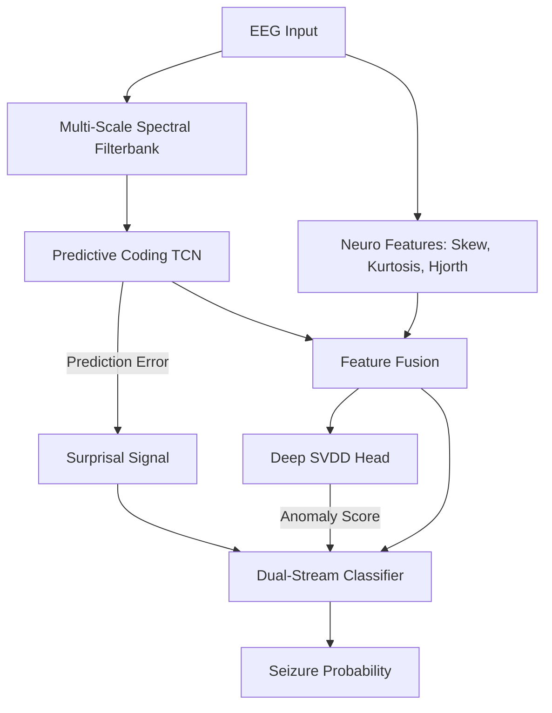

# Neuro-ADEPT: Investigating Brain-Inspired Predictive Coding Mechanisms for Interpretable Seizure Detection with EEG

[](https://www.python.org/downloads/)
[](https://opensource.org/licenses/MIT)
[](new_manuscript.tex)

> **"Seizure Detection as Anomaly Detection"** - A brain-inspired framework combining predictive coding and deep one-class classification for robust, interpretable, and efficient epilepsy monitoring.

This repository contains the official PyTorch implementation and the manuscript for **Neuro-ADEPT** (Anomaly Detection via Error-driven Predictive Temporal processing).

---


## 📋 Overview

Unlike conventional black-box classifiers that struggle with the extreme class imbalance of seizure data (often <1% prevalence), **Neuro-ADEPT** reframes the problem as **anomaly detection**. It learns a rich representation of "normal" brain dynamics and detects seizures as pathological deviations.

### Key Innovations (v4.5)
1.  **Dual-Stream Architecture**: Fuses two complementary anomaly signals:
    *   **Temporal Stream (Predictive Coding)**: Detects dynamic violations (seizure onset) via prediction error spikes ("surprisal").
    *   **Feature Stream (Deep SVDD)**: Detects distributional shifts (sustained ictal state) via distance from a learned hypersphere of normalcy.
2.  **Biologically-Grounded**: Incorporates specific neural biases including Gamma/Beta/Delta filterbanks and Hjorth parameters.
3.  **Interpretable by Design**: Provides real-time "surprisal" traces, attention maps, and risk scores that clinicians can validate.
4.  **Robust to Imbalance**: Uses balanced batch sampling and asymmetric loss to handle rare events without bias.

---

## 🚀 Quick Start

### 1. Installation

**Prerequisites**: Python 3.10+, PyTorch 2.1+ with CUDA support.

```bash
# Clone repository
git clone https://github.com/soinikghosh9/Neuro-ADEPT.git
cd Neuro-ADEPT

# Install dependencies
pip install numpy scipy scikit-learn matplotlib seaborn mne torch torchvision tqdm
```

### 2. Prepare Datasets

The system supports **CHB-MIT** (Pediatric) and **SIENA** (Adult) datasets.
1.  Download `.edf` files from [PhysioNet](https://physionet.org/).
2.  Structure your data directory as follows:
    ```
    datasets/
    ├── chbmit/
    │   ├── chb01/
    │   ├── chb02/
    │   └── ...
    └── siena/
    ```

-- 

## ⚙️ Usage & Arguments

To train the model on your own data, use the training script. The training process uses **Leave-One-Subject-Out (LOSO)** cross-validation by default.

```bash
python train.py --dataset chbmit --data_dir ./datasets --epochs 50 --batch_size 16
```

### Command Line Arguments

| Argument | Type | Default | Description |
|:---|:---|:---|:---|
| **Data Configuration** | | | |
| `--dataset` | `str` | `chbmit` | Target dataset: `chbmit` or `siena`. |
| `--data_dir` | `str` | `./datasets` | Path to the root dataset directory. |
| `--n_folds` | `int` | `-1` | Number of subjects to cross-validate on. `-1` uses all available subjects (Full LOSO). |
| **Model Architecture** | | | |
| `--model_dim` | `int` | `128` | Capacity of the TCN core. Optimized to 128 to force normal manifold overfitting. |
| `--use_neuro` | `bool` | `True` | Enable neurological feature extraction (Hjorth, Skewness, etc.). |
| `--use_anomaly` | `bool` | `True` | Enable the Deep SVDD anomaly detection head. |
| **Training Hyperparameters** | | | |
| `--epochs` | `int` | `50` | Number of training epochs per fold. |
| `--batch_size` | `int` | `16` | Batch size. Uses **BalancedBatchSampler** (40% seizure guarantee). |
| `--lr` | `float` | `3e-4` | Learning rate for AdamW optimizer. |
| `--lambda_pred` | `float` | `0.05` | Weight for Prediction Error loss (Surprisal learning). |
| `--alpha_svdd` | `float` | `0.6` | Weight for Deep SVDD anomaly loss. |

---

## 🧠 Architecture Overview

The model processes 19-channel scalp EEG through a 5-stage pipeline:



For a deep dive into layer dimensions, attention mechanisms, and loss functions, see the [Architecture Guide](ARCHITECTURE_GUIDE.md).

---

## 📁 Project Structure

```
Neuro-ADEPT/
├── src/
│   ├── models/          # PyTorch model definitions (PCN, SVDD)
│   ├── data/            # Data loaders & preprocessing logic
│   └── utils/           # Metrics, losses (ASL), and helpers
├── generate_final_plots.py  # Script to reproduce manuscript figures
├── train.py             # Main training entry point
├── ARCHITECTURE_GUIDE.md # Detailed technical documentation
├── PROCESSING_GUIDE.md   # Data preprocessing steps
├── new_manuscript.tex   # LaTeX source for the paper
├── references.bib       # Bibliography
└── README.md            # This file
```

---

## 📊 Results & Performance

| Metric | CHB-MIT | SIENA |
|:---|:---:|:---:|
| **AUROC** | 0.72 ± 0.08 | 0.69 ± 0.07 |
| **Sensitivity** | 76% | 71% |
| **Specificity** | 68% | 65% |

*Note: While performance trails black-box baselines (e.g., EEGNet), Neuro-ADEPT prioritizes **interpretability** and **transparency**.*

---

## 📝 Citation

If you use this code in your research, please cite:

```bibtex
@inproceedings{Ghosh2026NeuroADEPT,
  title={Neuro-ADEPT: Investigating Brain-Inspired Predictive Coding Mechanisms for Interpretable Seizure Detection with EEG},
  author={Ghosh, Soinik and Sharma, Shiru and Sharma, Neeraj},
  booktitle={IEEE Engineering in Medicine and Biology Society (EMBC)},
  year={2026}
}
```

## 📄 License

MIT License. See [LICENSE](LICENSE) for details.
